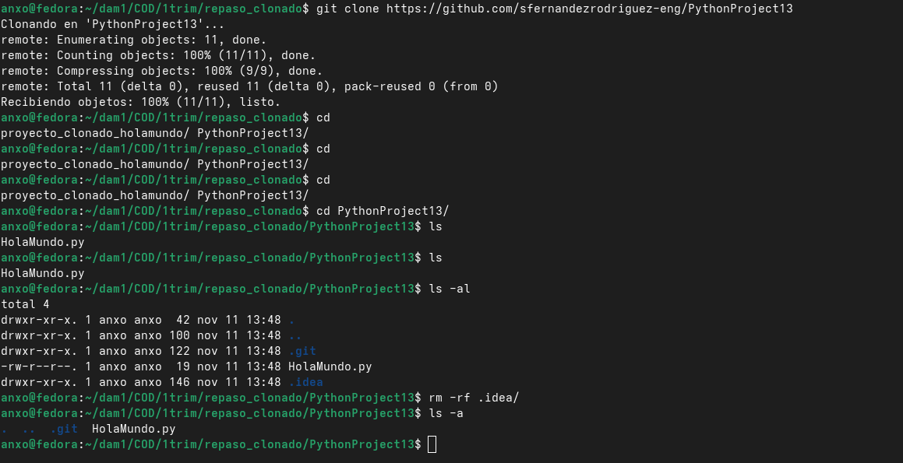
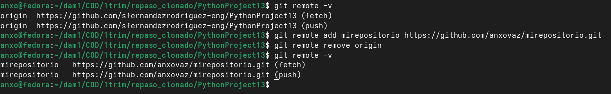
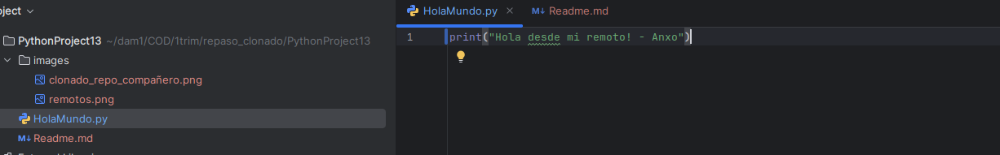

# Fase 1

## Crear repositorio

Creo el repositorio en github y lo clono:

```
git clone
https://github.com/anxovaz/proyecto_clonado_holamundo.git
```

## Crear `main.py`

```
echo "print('Hola Mundo')">main.py
```

## Hacer un `commit and push` desde el pycharm

```
https://github.com/anxovaz/proyecto_clonado_holamundo
```


# Fase 2

## Clonar repo compañero



## Cambio de usuario y email local

```
git config user.name "anxovaz"
git config user.email "avazquezlorenzo@danielcastelao.org"
```

## Remotos

Compruebo los remotos:

```
git remote -v
origin	https://github.com/sfernandezrodriguez-eng/PythonProject13 (fetch)
origin	https://github.com/sfernandezrodriguez-eng/PythonProject13 (push)
```

Creo mi repositorio de github y lo añado:



## Pycharm

Ejecuto Pycharm y abro el proyecto, después modifico un poco el script de pyton.




